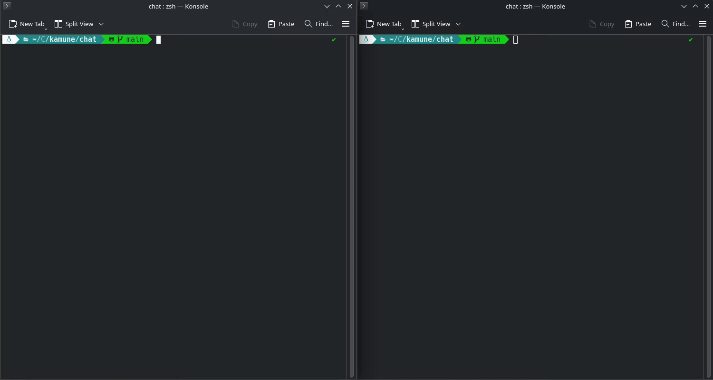

# Kamune

Communication over untrusted networks.

Kamune provides `Ed25519_ML-KEM-768_HKDF_SHA512_ChaCha20-Poly1305` security
suite.

> [!NOTE]
> This is an experimental project. All suggestions and feedbacks are welcome and
> greatly appreciated.

## Features

- Message signing and verification using **Ed25519**
- Ephemeral, quantum-resistant key encapsulation with **ML-KEM-768**
- Key derivation via **HKDF-SHA512** (HMAC-based extract-and-expand)
- End-to-End, bidirectional symmetric encryption using **ChaCha20-Poly1305**
- **Replay attack protection** via message sequence numbering
- Lightweight, custom **TCP-based protocol** for minimal overhead
- **Real-time, instant messaging** over socket-based connection
- **Direct peer-to-peer communication**, no intermediary server required
- **Protobuf** for fast, compact binary message encoding

## How does it work?

There are three stages. In the following terminology, server is the party who is
accepting connections, and the client is the party who is trying to establish a
connection to the server.

### Introduction

Client sends its public key (think of it like an ID card) to the server and
server, in return, responds with its own public key (ID card). If both parties
verify the other one's identity, handshake process gets started.

### Handshake

Client creates a new, ephemeral (one-time use) ml-kem key. Its public key,
alongside a randomly generated nonce (a nonce prefix, to be exact) are sent to
the server.

Server uses that public key to derive a secret (as well as a ciphertext that
we'll get to in a minute). Using that secret, a decryption cipher is created. To
decrypt each message, a combination of nonce-prefix and the sequence number are
used.  
By deriving another key from the secret, an encryption cipher is also created.
The ciphertext and a newly generated nonce are sent back to the client.

Client uses the received ciphertext and its private key (that was previously
generated), to derive the same exact secret as the client. Then, encryption and
decryption ciphers are created.

Finally, to make sure everyone are on the same page, a static message is sent to
the other party. They should decrypt the message, encrypt it again with their
own encryption cipher, and send it back. If each side receive and successfully
decrypt the message, handshake is deemed successful!

### Communication

Imagine a post office. When a cargo is accepted, A unique signature is generated
based on its content and the sender's identity. Everyone can verify the
signature, but only the sender can issue a new one.  
The cargo, the signature, and some other info such as timestamp and a number
(sequence) are placed inside a box. Then, the box will be locked and sealed.
Shipment will be done via a custom gateway specifically designed for this, and
it will deliver the package straight to the recipient.

At destination, the parcel will be checked for any kind of temperaments or
changes. Using pre-established keys from the handshake phase, smallest
modifications will be detected and the package is rejected. If all checks pass
successfully, the cargo will be delivered.
